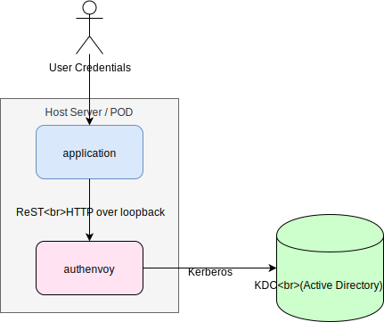

# authenvoy
[](https://goreportcard.com/report/github.com/jcmturner/authenvoy) [](https://travis-ci.org/jcmturner/authenvoy)

authenvoy provides a simple ReST interface for performing user authentication against a Kerberos Domain Controller (KDC).



The aim is to make it simpler for applications that use form based authentication to securely validate the credentials that are posted to them.

### Connectivity
The authenvoy implements the ambassador pattern.
HTTP (not HTTPS) is used between the application and the authenvoy in order to avoid the complexity of certificate management.
To ensure that this unencrypted HTTP connection is not over the network the authenvoy will _only_ listen on loopback.
The connection to the KDC uses the kerberos protocol.
The net result is that the **user's credentials are never sent over the network** other than when they are posted into the application.

### Usage
#### Input
From the application POST user credentials to the following endpoint:
```
http://localhost:8088/v1/authenticate
```
(the port number is configurable)

The user's credentials can be sent either a a JSON document or as an HTTP form:
##### JSON POST
When POSTing credentials in JSON the following format must be used:
```json
{
	"LoginName": "loginname",
	"Domain": "EXAMPLE.COM",
	"Password": "passwordvalue"
}
```
##### Form POST
Credentials can be sent by POSTing as a form.
When doing this the ``Content-Type`` header must be set to:
```
application/x-www-form-urlencoded
```
The following form fields must be provided:
* ``login-name``
* ``domain``
* ``password``

#### Output
The response from the authenvoy ReST API will be in JSON form.
##### Successful Authentication
Below is an example of successful authentication:
```json
{
    "Valid": true,
    "Domain": "USER.GOKRB5",
    "LoginName": "testuser1",
    "DisplayName": "Test1 User1",
    "Groups": [
        "S-1-5-21-2284869408-3503417140-1141177250-1110",
        "S-1-5-21-2284869408-3503417140-1141177250-513",
        "S-1-5-21-2284869408-3503417140-1141177250-1109",
        "S-1-5-21-0-0-0-497",
        "S-1-18-1"
    ],
    "AuthTime": "2018-11-30T12:00:41Z",
    "SessionID": "d6e7d370-498a-d6fc-a01d-c228fdb9a2e9",
    "Expiry": "2018-11-30T22:00:41Z"
}
```
Your code **MUST** check the "Valid" field.
Other information about the user is also provided. 
Most of this information is self explanatory but some additional information is available if Active Directory (AD) is used as the KDC.
* ``DisplayName`` - the full display name of the user in AD
* ``Groups`` - a list of the groups the user is a member of. These are the underlying SIDs of the AD groups. 
The group SIDs can be used for authorization in your application.

In addition a unique ``SessionID`` is provided. 
This can be used in the application and is logged in the authenvoy's logs to allow tracing of the user session including the authentication.

The application can choose to use the ``Expiry`` time for re-authentication. 
This is derived from the KDC's configuration for max age of tickets.

##### Failed Authentication
If authentication fails the response will be:
```json
{
    "Valid": false,
    "Domain": "USER.GOKRB5",
    "LoginName": "testuser1",
    "DisplayName": "testuser1",
    "Groups": null,
    "AuthTime": "0001-01-01T00:00:00Z",
    "SessionID": "",
    "Expiry": "0001-01-01T00:00:00Z"
}
```

### Configuration
There are only three configurations needed for authenvoy:
```
Usage of ./authenvoy:
  -krb5-conf string
    	Path to krb5.conf file. (default "./krb5.conf")
  -log-dir string
    	Directory to output logs to. (default "./")
  -port int
    	Port to listen on loopback. (default 8088)
  -version
    	Print version information.
```
For the krb5.conf file please see: https://web.mit.edu/kerberos/krb5-latest/doc/admin/conf_files/krb5_conf.html

Log files will be placed in the directory specified by the -log-dir argument.
There are three special values to this argument:
* ``stdout`` - all log lines will be sent to stdout.
* ``stderr`` - all log lines will be sent to stderr.
* ``null`` - all log lines will be discarded.

The log files generated are:
* ``event.log`` - this tracks the authentication requests and steps to process it.
* ``access.log`` - this provides HTTP style access logging in a structured JSON format.
* ``authenvoy.log`` - this provides logging of any errors or information from the authenvoy process.

### Building
```
go build -ldflags "-X main.buildtime=`date -u '%FT%T%Z'` -X main.githash=`git rev-parse HEAD`"
```